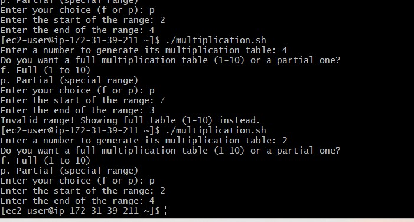

# Capstone Project-Linux Shell Scripting

## Multiplication Table Generator

This Bash script helps to generates a multiplication table for a number entered by the user. This project will help you practice using loops, handling user input and applying conditinal logic in Bash Scripting


## Usage
   1. log into my ubutu server
   2. Create multiplication.sh and run the command Vim multiplication.sh
   3. Start your shell scripting with following command
   `#!/bin/bash`

   4. after i can make the script executable at this stage by using the following command

   `chmod +x multiplication.sh`

   5. To run the the script,i ran this command

   `./multiplication.sh`

   ## Script Breakdown

   1. Prompting User Input;
    The script starts by asking the user to enter a number for the multiplication table to be generated
     `read -p "Enter a number for the multiplication table: " number`

  2. Validate the input number;
  `if ! [[ "$number" =~ ^[0-9]+$ ]]; then 
   echo "Invalid number. Please enter a valid integer." 
   exit 1
   fi`
   

  3. Full or Partial Table Choice;
   The user is asked whether they want a full table or a partial table
    `read -p "Do you want a full table or a partial table? (Enter 'f' for full, 'p' for partial): " choice`

    * If the user chooses full table (f) the script will generate a multiplication table starting from 1 to 10.
   /images/full-multiplication-table.jpg 
    

    * For Partial table, the user chooses (p), the script prompt the starting and the ending numbers of the range. To validate this it has to be within the 1 to 10 and the start is less than or equal to the end
    

```markdown
#!/bin/bash
read -p "Enter a number to generate its multiplication table: " number
  # Validate if the input is a valid number
if ! [[ "$number" =~ ^[0-9]+$ ]]; then
    echo "Invalid input! Please enter a valid number."
    continue
fi
 # Step 2: Ask if the user wants a full table or partial
echo "Do you want a full multiplication table (1-10) or a partial one?"
echo "f. Full (1 to 10)"
echo "p. Partial (special range)"
read -p "Enter your choice (f or p): " choice
```
### below is the summary of the command
 i ran to prompt if partial or full, handling user input and applying conditinal logic

#!/bin/bash
while true; do
  # Step 1: Ask the user for a number
  read -p "Enter a number to generate its multiplication table: " number
  # Validate if the input is a valid number
  if ! [[ "$number" =~ ^[0-9]+$ ]]; then
    echo "Invalid input! Please enter a valid number."
    continue
  fi
  # Step 2: Ask if the user wants a full table or partial
  echo "Do you want a full multiplication table (1-10) or a partial one?"
  echo "f. Full (1 to 10)"
  echo "p. Partial (special range)"
  read -p "Enter your choice (f or p): " choice

  `if [ "$choice" == "f" ]; then
    # Full table (1 to 10)
    echo "Multiplication Table for $number"
    echo "---------------------------"
    for i in {1..10}; do
      echo "$number x $i = $((number * i))"
    done
  elif [ "$choice" == "p" ]; then
    # Partial table, ask for start and end range
    read -p "Enter the start of the range: " start
    read -p "Enter the end of the range: " end
    # Validate if the start and end inputs are valid numbers and if start is less than or equal to end
    if ! [[ "$start" =~ ^[0-9]+$ ]] || ! [[ "$end" =~ ^[0-9]+$ ]] || [ "$start" -gt "$end" ]; then
      echo "Invalid range! Showing full table (1-10) instead."
      start=1
      end=10
    fi
    # Generate partial table
    echo "Multiplication Table for $number (from $start to $end)"
    echo "-----------------------------------"
    for ((i=start; i<=end; i++)); do
      echo "$number x $i = $((number * i))"
    done
  else
    echo "Invalid choice! Please enter f for full or p for partial."
    continue
  fi`
  # Step 6: Ask if the user wants to repeat the process
  read -p "Do you want to generate another table? (y/n): " repeat
  if [[ "$repeat" != "y" ]]; then
    echo "Exiting the program."
    break
  fi
done